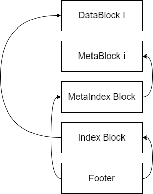
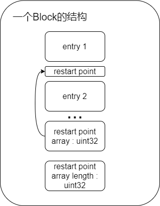

## LevelDb SSTable

leveldb按照下面的格式来组织一个SSTable



除了Footer，其他的所有数据结构都能够抽象出一个统一的数据结构**block**，每一个block由多个entry组成，每一个entry又是由一个kv组成的

在leveldb中，entry的格式如下：

```
<entry start>
共享的前缀长度 :varint
非共享的前缀长度 :varint
value长度 :varint
key_delta( 长度为len(key)-共享前缀长度 ) :[]byte
value :[]byte
<entry end>
```

上面提到了**前缀长度**，这是前缀压缩引出的概念

#### 前缀压缩

leveldb的key不仅是有序排列的，并且还实现了前缀压缩的方法，例如`key1=hello, key2=helloWorld, key3=helloWorldMan`，经过前缀压缩后，`key2=5,World ; key3=10,Man`，也就是说前缀压缩会累加当前字符串。由于key的有序的，所以在经过了$K$次插入后，难免前缀会发生改变，所以$K$次插入后需要重新重新计算前缀，我们把重新计算前缀后的第一个插入的Key的起始位置叫做一个**重置点**。

#### block的结构




#### 接口设计

```go
type blockWriter interface {
    // 向block中新增一条kv数据
    addEntry(key, value Slice)
    // 将block转换到slice（适配文件接口），并且标记该block已经填充完毕，需要使用Reset()重置所有数据
    finish() Slice
    // 重置数据内容 + 重启点信息
    reset()
    // 获取当前Block的大小
    size()
}
```


---

上面讨论了blockWriter的相关实现，blockWriter对应地由tableWriter来调用，下面来讨论tableWriter的相关实现

tableWriter需要提供的功能：

- 综合data block和index block，提供添加kv的能力

  参考leveldb实现：

  ```c++
  void TableBuilder::Add(const Slice& key, const Slice& value) {
    Rep* r = rep_;
    assert(!r->closed);
    if (!ok()) return;
    if (r->num_entries > 0) {
      assert(r->options.comparator->Compare(key, Slice(r->last_key)) > 0);
    }
  
    if (r->pending_index_entry) {
      assert(r->data_block.empty());
      r->options.comparator->FindShortestSeparator(&r->last_key, key);
      std::string handle_encoding;
      r->pending_handle.EncodeTo(&handle_encoding);
      r->index_block.Add(r->last_key, Slice(handle_encoding));
      r->pending_index_entry = false;
    }
  
    if (r->filter_block != nullptr) {
      r->filter_block->AddKey(key);
    }
  
    r->last_key.assign(key.data(), key.size());
    r->num_entries++;
    r->data_block.Add(key, value);
  
    const size_t estimated_block_size = r->data_block.CurrentSizeEstimate();
    if (estimated_block_size >= r->options.block_size) {
      Flush();
    }
  }
  ```

  

- 提供flush block到file的能力

  参考leveldb的主要实现：

  ```c++
  void TableBuilder::WriteRawBlock(const Slice& block_contents,
                                   CompressionType type, BlockHandle* handle) {
    Rep* r = rep_;
    handle->set_offset(r->offset);
    handle->set_size(block_contents.size());
    r->status = r->file->Append(block_contents);
    if (r->status.ok()) {
      char trailer[kBlockTrailerSize];
      trailer[0] = type;
      uint32_t crc = crc32c::Value(block_contents.data(), block_contents.size());
      crc = crc32c::Extend(crc, trailer, 1);  // Extend crc to cover block type
      EncodeFixed32(trailer + 1, crc32c::Mask(crc));
      r->status = r->file->Append(Slice(trailer, kBlockTrailerSize));
      if (r->status.ok()) {
        r->offset += block_contents.size() + kBlockTrailerSize;
      }
    }
  }
  ```

  

接口设计

```go
type TableWriter interface {
    Add(k, v Slice)
    Finish() error
}
```

